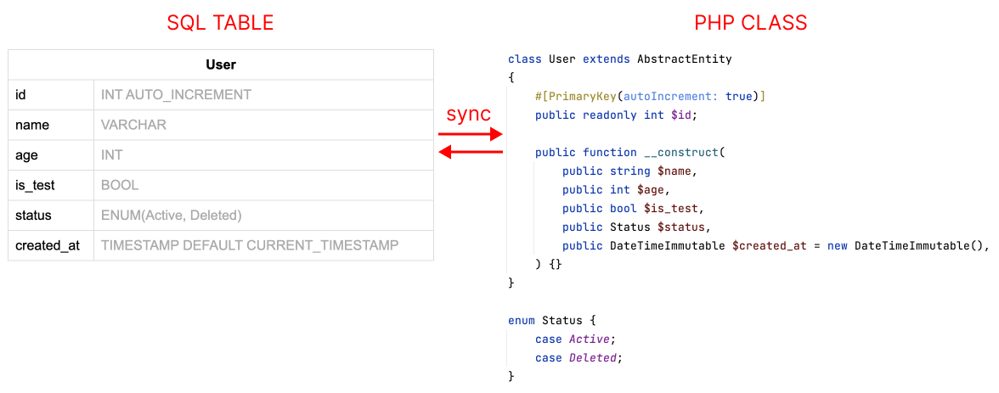

# Composite Sync

Composite Sync is a powerful and flexible PHP library designed to streamline and automate the synchronization process between SQL database table structures and PHP entity classes. 
By providing a set of easy-to-use tools, Composite Sync eliminates the need for manual synchronization and helps you maintain the consistency of your application's data model.

## Key Features
* **Migrations**: Update your PHP entity classes and generate migration files using a simple console command. These migration files can be applied to create or alter your SQL tables, ensuring that your database schema is always up to date.
* **Entity Generation**: Automatically parse your SQL table structure and generate corresponding PHP [entity](https://github.com/compositephp/entity) classes that represent your database schema. This feature saves time and reduces the potential for errors in your data model.



## Supported Platforms
* Migrations: MySQL
* Entity generations: MySQL, Postgres, SQLite

## Requirements

* PHP 8.1+
* PDO Extension with desired database drivers

## Getting Started

To begin using Composite Sync in your project, follow these steps:

### 1. Install package via composer:
 ```shell
 $ composer require compositephp/sync
 ```
### 2. Configure connections

You need to have a configuration file that generates an array of database connection settings, 
following the format specified by [Doctrine DBAL](https://www.doctrine-project.org/projects/doctrine-dbal/en/current/reference/configuration.html).

```php
<?php declare(strict_types=1);
return [
    'sqlite' => [
        'driver' => 'pdo_sqlite',
        'path' => '/path/to/your/sqlite/database.db',
    ],
    'mysql' => [
        'driver' => 'pdo_mysql',
        'dbname' => 'name_of_your_db',
        'user' => 'your_username',
        'password' => 'your_password',
        'host' => '127.0.0.1',
    ],
    'postgres' => [
        'driver' => 'pdo_pgsql',
        'dbname' => 'name_of_your_db',
        'user' => 'your_username',
        'password' => 'your_password',
        'host' => '127.0.0.1',
    ],
];
```

### 3. Configure commands

Here is an example of a minimalist, functional PHP file:

```php
<?php declare(strict_types=1);
include 'vendor/autoload.php';

use Composite\Sync\Commands;
use Symfony\Component\Console\Application;

//may be changed with .env file
putenv('CONNECTIONS_CONFIG_FILE=/path/to/your/connections/config.php');
putenv('MIGRATIONS_DIR=/path/to/your/app/migrations');

$app = new Application();
$app->addCommands([
     new Commands\MigrateCommand(),
     new Commands\MigrateNewCommand(),
     new Commands\MigrateDownCommand(),
     new Commands\GenerateTableCommand(),
     new Commands\GenerateEntityCommand(),
]);
$app->run();
```

Commands overview:
* [composite:migrate](#composite-migrate) - generate and apply migrations
* [composite:migrate-down](#composite-migrate-down]) - rollback migrations
* [composite:migrate-new](#composite-migrate-new) - create blank migration
* [composite:generate-entity](#composite-generate-entity) - generate Entity class from SQL table
* [composite:generate-table](#composite-generate-table) - Generate Table class from Entity

## Migration commands

* ### composite:migrate

The command performs a comprehensive scan of the application directory for all PHP classes inheriting from [Composite\Entity\AbstractEntity](https://github.com/compositephp/entity). 
It then compares the schema defined in these classes with the actual schema present in the database tables. 
Upon identifying any differences, it generates migration files. 
When executed, these files run SQL queries that harmonize the schema outlined in the PHP entity files with the one in the 
database tables, thereby ensuring synchronization between the two.

```shell
php cli.php composite:migrate
```

| Option       | Description                                               |
|--------------|-----------------------------------------------------------|
| --run        | Execute migrations without asking for confirmation        |
| --entity     | Check only certain entity                                 |
| --connection | Check only entities with certain connection name          |
| --dry        | Dry run mode simulates SQL queries without executing them |


* ### composite:migrate-down

The command reverses the most recent migration applied to a specific database. 
This command identifies and undoes the changes made by the last migration, using the 'down' methods specified in the migration file. 
It is particularly useful when a recent migration results in errors, allowing for safe reversion without compromising database integrity. 
Essentially, it provides a fail-safe option to maintain control over your database schema modifications.

```shell
php cli.php composite:migrate-down connection_name 1
```

| Argument    | Required | Description                                              |
|-------------|----------|----------------------------------------------------------|
| connection  | Yes      | Name of connection where migration should be rolled back |
| limit       | No       | Number of migrations (Default: 1)                        |

Options:

| Option       | Description                                               |
|--------------|-----------------------------------------------------------|
| --dry        | Dry run mode simulates SQL queries without executing them |


* ### composite:migrate-new


The command generates a new blank migration file, providing a space where you can input your required SQL queries for schema modifications.

```shell
php cli.php composite:migrate-new connection_name 'Some description about your new migration'
```

| Argument    | Required | Description                                                              |
|-------------|----------|--------------------------------------------------------------------------|
| connection  | Yes      | Name of connection where migration will be applied                       |
| description | Yes      | Short text about your intentions, will be used for file name generation  |

## Generator commands

* ### composite:generate-entity

The command examines the specific SQL table and generates an [Composite\Entity\AbstractEntity](https://github.com/compositephp/entity) PHP class. 
This class embodies the table structure using native PHP syntax, thereby representing the original SQL table in a more PHP-friendly format.

```shell
php cli.php composite:generate-entity connection_name TableName 'App\Models\EntityName'
```

| Argument   | Required | Description                                          |
|------------|----------|------------------------------------------------------|
| connection | Yes      | Name of connection from connection config file       |
| table      | Yes      | Name of SQL table                                    |
| entity     | Yes      | Full classname of the class that needs to be created |

Options:

| Option  | Description             |
|---------|-------------------------|
| --force | Overwrite existing file |

* ### composite:generate-table

The command examines the specific Entity and generates a [Table](https://github.com/compositephp/db) PHP class.
This class acts as a gateway to a specific SQL table, providing user-friendly CRUD tools for interacting with SQL right off the bat.

```shell
php cli.php composite:generate-table connection_name TableName 'App\Models\EntityName'
```

| Argument  | Required | Description                                   |
|-----------|----------|-----------------------------------------------|
| entity    | Yes      | Full Entity classname                         |
| table     | No       | Full Table classname that needs to be created |

Options:

| Option   | Description                                |
|----------|--------------------------------------------|
| --cached | Generate cached version of PHP Table class |
| --force  | Overwrite existing file                    |

## License:

MIT License (MIT). Please see [`LICENSE`](./LICENSE) for more information. Maintained by Composite PHP.
